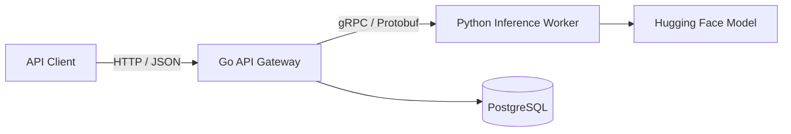

# Sentiment Analysis Microservice

An English-language sentiment analysis service composed of a Go API gateway, a Python gRPC inference worker, and PostgreSQL. The complete stack runs locally with Docker Compose.

## Features

- REST API built with Go and Gin
- Batch sentiment analysis with Hugging Face Transformers
- gRPC communication between the gateway and inference worker
- PostgreSQL persistence through GORM
- Five-second inference timeout that follows HTTP request cancellation
- Health checks for PostgreSQL, the worker, and the gateway
- Environment-based service, database, model, and logging configuration

## Architecture



| Service | Responsibility | Technology |
| --- | --- | --- |
| Gateway | Handles HTTP requests, calls the worker, and stores results | Go / Gin / GORM |
| Worker | Runs sentiment inference | Python / Transformers / PyTorch |
| PostgreSQL | Persists analysis history | PostgreSQL 15 |

## Getting Started

### Requirements

- Docker Desktop or Docker Engine
- Docker Compose v2
- Network access during the first startup to download container images and the Hugging Face model

### 1. Configure the environment

macOS / Linux:

```bash
cp .env.example .env
```

Windows PowerShell:

```powershell
Copy-Item .env.example .env
```

Set `POSTGRES_PASSWORD` in `.env` to a local development password. The `.env` file is excluded from Git.

### 2. Start the services

```bash
docker compose up --build -d
docker compose ps
```

The worker downloads its model on first startup, so it may take several minutes to become healthy. Follow its startup progress with:

```bash
docker compose logs -f worker
```

### 3. Analyze text

Endpoint:

```text
POST http://localhost:8080/api/v1/analyze
```

Request:

```bash
curl -X POST http://localhost:8080/api/v1/analyze \
  -H "Content-Type: application/json" \
  -d '{"texts":["I really enjoyed this product.","This was a terrible experience."]}'
```

Response example:

```json
{
  "status": "success",
  "results": [
    {
      "sentiment": "POSITIVE",
      "confidence_score": 0.999
    },
    {
      "sentiment": "NEGATIVE",
      "confidence_score": 0.999
    }
  ],
  "total_processing_time_ms": 135
}
```

Scores and processing time vary by input and runtime environment.

Gateway health check:

```bash
curl http://localhost:8080/healthz
```

### 4. Stop the services

```bash
docker compose down
```

This command preserves the PostgreSQL data and model-cache named volumes.

## Environment Variables

The main settings are documented in [.env.example](.env.example).

| Variable | Purpose | Example |
| --- | --- | --- |
| `POSTGRES_USER` | PostgreSQL user | `sentiment_app` |
| `POSTGRES_PASSWORD` | PostgreSQL password | Local development password |
| `POSTGRES_DB` | Database name | `sentiment_db` |
| `POSTGRES_HOST_PORT` | PostgreSQL host port | `5432` |
| `GATEWAY_HOST_PORT` | Gateway HTTP host port | `8080` |
| `GRPC_WORKER_ADDRESS` | Worker address used by the gateway | `worker:50051` |
| `DB_HOST` / `DB_PORT` | Database address used by the gateway | `postgres` / `5432` |
| `DB_SSLMODE` | PostgreSQL SSL mode | `disable` |
| `DB_TIMEZONE` | Database and container time zone | `Asia/Tokyo` |
| `MODEL_NAME` | Hugging Face model ID | `distilbert/...-sst-2-english` |
| `GRPC_MAX_WORKERS` | Python gRPC thread count | `10` |
| `LOG_LEVEL` | Worker logging level | `INFO` |

To run the gateway outside Docker Compose, copy `gateway/inf.env.example` to `gateway/inf.env` and adjust the service addresses.

## Regenerating Protocol Buffer Code

Generated Go files belong in `gateway/proto`, while generated Python files belong in `worker`. Install the pinned generator versions before running the script:

```bash
python -m pip install -r worker/requirements-dev.txt
go install google.golang.org/protobuf/cmd/protoc-gen-go@v1.36.11
go install google.golang.org/grpc/cmd/protoc-gen-go-grpc@v1.6.1
```

Ensure the Go binary directory is on `PATH`, then run:

```bash
./gen.sh
```

Set `PYTHON_BIN` when the Python executable has a different name or path:

```bash
PYTHON_BIN=python3 ./gen.sh
```

## Project Structure

```text
.
├── gateway/                 # Go API gateway
│   ├── database/            # PostgreSQL connection
│   ├── models/              # GORM models
│   ├── proto/               # Generated Go protobuf code
│   └── Dockerfile
├── worker/                  # Python gRPC inference worker
│   ├── main.py
│   ├── healthcheck.py
│   ├── analysis_pb2*.py     # Generated Python protobuf code
│   ├── requirements-dev.txt # Protobuf generation dependency
│   └── Dockerfile
├── proto/analysis.proto     # Inter-service API definition
├── .env.example
└── docker-compose.yml
```

## Current Limitations

- Authentication and authorization are not implemented. Persisted records currently use a fixed `UserID` of `1`.
- The worker runs as a single container without load balancing or automatic scaling.
- Internal gRPC traffic is unencrypted, and rate limiting, distributed tracing, and metrics are not implemented.
- Database schema changes use GORM `AutoMigrate` instead of versioned migrations.
- The default model supports English binary sentiment classification (`POSITIVE` or `NEGATIVE`).
- Database persistence is best-effort: a failed write is logged but does not discard a successful inference response.
